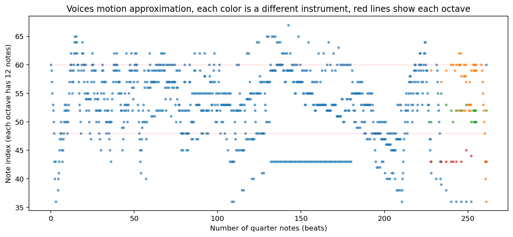
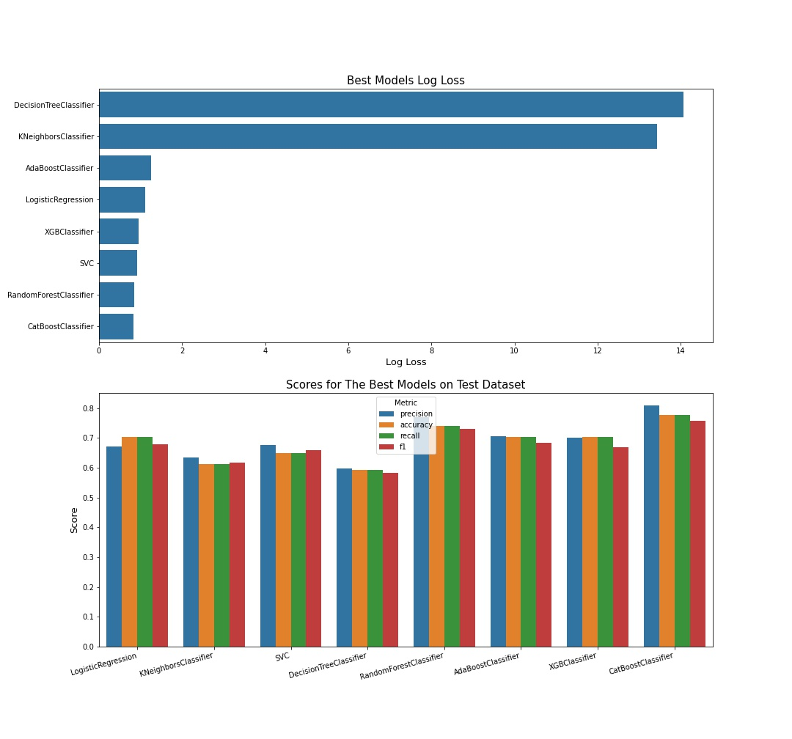
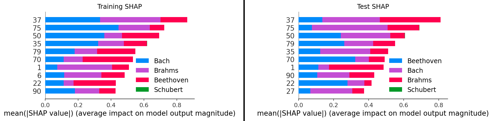

# MusicNet Classification 

## Business Understanding
A client has come to SFL Scientific trying to build a composer classifier based on live captured audio that can be set to stream chunks of data to our model at 15, 30, 60-second intervals if desired. In the interest of time, 30-seconds is the desired default setting analysis of how data quantity affects performance is not expected but will earn additional points. 

For this project, the client has collected and annotated several hundred audio files they have saved as simple midi files. The `PS1` folder contains known midi files pertaining to four (4) composers, specifically: Bach, Beethoven, Schubert, and Brahms. 

## Exploratory Data Analysis
The data primarily includes MIDI files, which convey information to recompose music using notes, delays, instruments and other parameters so that they can easily be reproduced. MIDIs are generally smaller in size compared to even the most compressed formats like MP3. They also include octave tone information, which means that spectral analysis is not necessary. To read MIDI files, a library called `music21` is installed. Functions to analyze MIDI files were taken from [Waldecir Faria]( https://towardsdatascience.com/midi-music-data-extraction-using-music21-and-word2vec-on-kaggle-cb383261cd4e) and [his post on Kaggle]( https://www.kaggle.com/code/wfaria/midi-music-data-extraction-using-music21). Before data preparation, let’s take a look at one of the MIDI files. Here is an image of contour plot for one of the MIDI files. 




## Modeling 
Eight types of classifiers were considered. For each model, a cross-validation with the imbalanced data was fitted on a stratified K-fold on the training dataset, where oversampling and class weights were applied. Based on cross-validation data, the class weight or oversampling technique (SMOTE, ADASYN or random) is chosen as the dataset to train over a list of models generated by the custom grid search class. The best performing model from each classifier was then chosen based on high F1, precision and recall metrics. The best models are then compared with each other to select the final classifier model. The following graphs show the different metrics for the best models from each classifier used. As a result, random forest classifier was selected as the best classifier (accuracy: 77.8%, precision: 81%, recall: 77.8% and F1 score: 75.7% on test dataset).  



And the total number of models trained for each classifier is shown in the table below. 

| LogisticRegression | KNeighborsClassifier | SVC | DecisionTree | RandomForest | AdaBoostClassifier | XGBoost | CatBoost |
| --- | --- | --- | --- | --- | --- | --- | --- |
| 40 | 118 | 90 | 242 | 16632 | 450 | 750 | 960 |


## Model Interpretation
SHAP (Shapely values) is used to measure the importance of each feature and return the top `n` features that have the highest impact on the models. SHAP also provides feature importance, but it does so by creating a pseudo data based on some of the training and test datasets. By following those steps, the importance of each feature can be quantified. The following plot shows the SHAP values computed over all task ids for both training and test datasets. Running the model can take a long time, so the model weights can be downloaded from [this link](https://drive.google.com/file/d/1AIfB3vJbeuspk3Q1dkVRn98Ft1Wz4hyk/view?usp=sharing) and save to `data/` directory. 



The two plots on training and test dataset show that **features 37, 75, 50, 35, 79, 70, 1, 90 and 22** have the highest impact on predicting the composer in both the training and test datasets. Only features **35, 50 and 75** appear to have higher impact in classifying Schubert.  

## Conclusion and Recommendation 
The final model was able to achieve 77.8% accuracy on the test dataset. However, it is possible to improve the prediction using neural networks, which were not implemented due to time constraint. In addition, the data imbalance has led to classifying fewer Schubert compositions compared to the rest. Another approach towards making classifications using regressive models instead of classifiers. In fact, this can greatly benefit in making predictions for MIDI files that were not composed by any of the composers. It would be interesting to investigate if more data that is balanced among the composers can benefit the prediction.

In this project, the harmonics were reduced to expedite embedding. It is possible that, by adding all notes, better prediction can be achieved. It is also important to note that arbitrary vector length of size 100 was considered to train the `Word2Vec` embedding. That can result in overfitting as more features are used to describe a composition. Even after accounting for class imbalance, in retrospect, taking that many features might not be a good approach. 

Lastly, as a recommendation, it would be interesting to compare the MIDI notes approach to some of the most common audio classification techniques, which is decomposing audio file to spectral power of frequencies using Fast Fourier Transforms (FFT) and employ spectrograms to identify notable frequencies and their levels. 

## For More Information

See the full analysis in the [Jupyter Notebook](./index.ipynb). 

## Repository Structure

```
├── images/
├── data/
├── Custom_GridSearchCV.py
├── utils.py
├── music_utils.py
├── summary.pkl
├── requirements.txt
├── Zipped pretrained model (https://drive.google.com/file/d/1AIfB3vJbeuspk3Q1dkVRn98Ft1Wz4hyk/view?usp=sharing)
├── index.html
└── index.ipynb 


